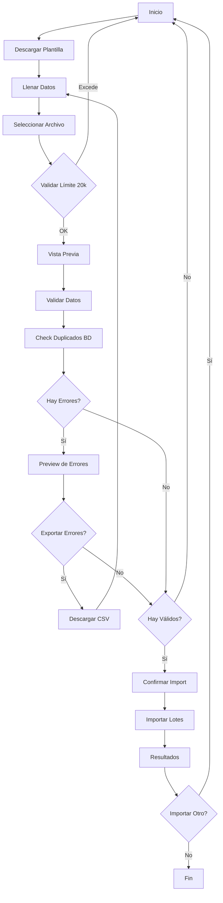

# 🚀 MEJORAS IMPLEMENTADAS - IMPORTACIÓN MASIVA DE CLIENTES

## Fecha de Implementación: Diciembre 2025

---

## 📋 RESUMEN DE MEJORAS

Se ha simplificado y mejorado significativamente el sistema de importación masiva de clientes, implementando todas las mejoras solicitadas:

### ✅ Mejoras Implementadas

1. **Límite de 20,000 registros implementado** ✓
2. **Validación de teléfonos duplicados en BD antes de importar** ✓
3. **Preview de errores antes de importar** ✓
4. **Plantilla Excel con instrucciones detalladas** ✓
5. **Exportación de errores a archivo CSV** ✓
6. **Esquema simplificado a 4 campos** ✓

---

## 🎯 CAMBIOS PRINCIPALES

### 1. Esquema Simplificado

**ANTES**: 23 campos diferentes (nombre, email, telefono, documento_identidad, direccion_*, etc.)

**AHORA**: Solo 4 campos esenciales:
- ✅ **nombre** (requerido)
- ✅ **apellido** (requerido)
- ✅ **telefono** (requerido)
- ✅ **proyecto_interes** (opcional)

### 2. Límite de Registros

```typescript
const MAX_RECORDS = 20000; // Límite máximo de registros por importación
```

- Se valida al parsear el archivo
- Muestra error claro si se excede el límite
- Resetea el formulario automáticamente

**Ubicación**: [ImportarClientes.tsx:37](../src/components/ImportarClientes.tsx#L37)

### 3. Validación de Teléfonos Duplicados

#### Nuevo Endpoint API: `/api/clientes/check-phones`

```typescript
POST /api/clientes/check-phones
{
  "phones": ["51987654321", "51912345678", ...]
}

Response:
{
  "existingPhones": ["51987654321"]
}
```

**Features:**
- Verifica teléfonos contra la BD ANTES de importar
- Usa la columna `phone_normalized` para comparación
- Normaliza teléfonos a solo dígitos
- Respuesta instantánea

**Ubicación**: [route.ts](../src/app/api/clientes/check-phones/route.ts)

### 4. Preview de Errores (Paso 3.5)

#### Nuevo Paso Intermedio en el Flujo

**Flujo ANTERIOR:**
1. Seleccionar archivo
2. Vista previa
3. Importar directamente
4. Ver resultados

**Flujo NUEVO:**
1. Seleccionar archivo
2. Vista previa de datos
3. **Validar y revisar errores** 🆕
4. Confirmar importación
5. Ver resultados

#### Features del Preview:
- ✅ Muestra cantidad de registros válidos/inválidos/duplicados
- ✅ Lista detallada de errores por fila
- ✅ Botón para exportar errores a CSV
- ✅ No permite importar si no hay registros válidos
- ✅ Aviso claro de cuántos registros se importarán

**Ubicación**: [ImportarClientes.tsx:589-675](../src/components/ImportarClientes.tsx#L589-L675)

### 5. Exportación de Errores a CSV

#### Función `exportErrors()`

```typescript
const exportErrors = () => {
  const errorsData = validationResult.errorsList.map(error => ({
    Fila: error.row,
    Nombre: error.data.nombre || '',
    Apellido: error.data.apellido || '',
    Telefono: error.data.telefono || '',
    Proyecto: error.data.proyecto_interes || '',
    Errores: error.errors.join('; ')
  }));

  // Exporta a CSV con Papa.unparse
}
```

**Features:**
- ✅ Botón disponible en paso 3.5 (preview) y paso 4 (resultados)
- ✅ Archivo CSV con nombre con fecha: `errores_importacion_2025-12-01.csv`
- ✅ Incluye todas las columnas + columna de errores
- ✅ Facilita corrección offline

**Ubicación**: [ImportarClientes.tsx:392-415](../src/components/ImportarClientes.tsx#L392-L415)

### 6. Plantilla Excel Mejorada

#### Estructura de 2 Hojas

**Hoja 1: Instrucciones**
- Descripción de columnas requeridas/opcionales
- Ejemplos de formatos válidos
- Proceso paso a paso
- Notas importantes
- Formatos de teléfono válidos
- Límites y restricciones

**Hoja 2: Plantilla**
- 5 ejemplos con datos reales
- 3 filas vacías para completar
- Columnas con ancho optimizado
- Lista para copiar y pegar

**Ubicación**: [generateTemplate.ts](../src/lib/generateTemplate.ts)

---

## 📊 MÉTRICAS Y VALIDACIONES

### Validaciones Implementadas

#### Frontend (antes de enviar):
```typescript
✓ Nombre requerido
✓ Apellido requerido
✓ Teléfono requerido
✓ Teléfono con formato válido
✓ Teléfono no duplicado en BD
```

#### Backend (al recibir):
```typescript
✓ Schema Zod validación
✓ Constraint único en BD (phone_normalized)
✓ Omisión automática de duplicados
```

### Métricas Reportadas

```typescript
interface ImportResult {
  total: number;         // Total de registros en archivo
  success: number;       // Registros importados exitosamente
  errors: number;        // Registros con errores
  duplicates: number;    // Registros duplicados (BD + archivo)
  errorsList: Array;     // Lista detallada de errores
}
```

---

## 🔧 ARCHIVOS MODIFICADOS/CREADOS

### Archivos Modificados
1. ✅ [src/components/ImportarClientes.tsx](../src/components/ImportarClientes.tsx)
   - Simplificado a 4 campos
   - Agregado límite de 20,000
   - Agregado paso 3.5 de preview
   - Agregada función exportErrors()
   - Agregada validación de duplicados en BD

2. ✅ [src/lib/generateTemplate.ts](../src/lib/generateTemplate.ts)
   - Reescrito completamente
   - 2 hojas: Instrucciones + Plantilla
   - Instrucciones detalladas
   - Ejemplos actualizados

3. ✅ [src/app/api/clientes/import/route.ts](../src/app/api/clientes/import/route.ts)
   - Schema simplificado a 4 campos
   - Construcción automática de nombre completo
   - Proyecto de interés en campo notas
   - Estado cliente: 'lead'
   - Tipo cliente: 'persona'

### Archivos Creados
4. ✅ [src/app/api/clientes/check-phones/route.ts](../src/app/api/clientes/check-phones/route.ts)
   - Nuevo endpoint para verificar duplicados
   - Búsqueda por phone_normalized
   - Respuesta con lista de teléfonos existentes

---

## 🎨 INTERFAZ DE USUARIO

### Paso 1: Selección de Archivo
```
┌─────────────────────────────────────────────────────────┐
│              📁 Seleccionar Archivo                     │
│                                                         │
│  [Seleccionar Archivo]                                 │
│                                                         │
│  Formato del archivo:                                  │
│  • Nombre (requerido)                                  │
│  • Apellido (requerido)                                │
│  • Teléfono / Celular (requerido)                      │
│  • Proyecto de Interés (opcional)                      │
│                                                         │
│  Límite: Hasta 20,000 registros                        │
│                                                         │
│  [📥 Descargar plantilla con instrucciones]            │
└─────────────────────────────────────────────────────────┘
```

### Paso 2: Vista Previa
```
┌─────────────────────────────────────────────────────────┐
│            👁️ Vista Previa de Datos                     │
│                                                         │
│  Se encontraron 1,250 registros                        │
│                                                         │
│  ┌────┬──────────┬───────────┬──────────┬──────────┐  │
│  │ #  │ nombre   │ apellido  │ telefono │ proyecto │  │
│  ├────┼──────────┼───────────┼──────────┼──────────┤  │
│  │ 1  │ Juan     │ Pérez     │ 519876...│ Res...   │  │
│  └────┴──────────┴───────────┴──────────┴──────────┘  │
│                                                         │
│  [← Seleccionar otro]  [Validar y Continuar →]        │
└─────────────────────────────────────────────────────────┘
```

### Paso 3.5: Preview de Errores 🆕
```
┌─────────────────────────────────────────────────────────┐
│          ⚠️ Resultado de la Validación                  │
│                                                         │
│  ┌─────────┬──────────┬──────────┬─────────────┐      │
│  │ 1,250   │ 1,180    │ 50       │ 20          │      │
│  │ Total   │ Válidos  │ Errores  │ Duplicados  │      │
│  └─────────┴──────────┴──────────┴─────────────┘      │
│                                                         │
│  ❌ Errores encontrados:  [Exportar a CSV]             │
│  • Fila 45: Teléfono ya existe en BD                   │
│  • Fila 78: Teléfono inválido                          │
│  • Fila 123: Nombre es requerido                       │
│                                                         │
│  ℹ️ Se importarán 1,180 registros válidos              │
│                                                         │
│  [← Seleccionar otro]  [Confirmar Importación]        │
└─────────────────────────────────────────────────────────┘
```

### Paso 4: Resultados
```
┌─────────────────────────────────────────────────────────┐
│         ✅ Resultado de la Importación                  │
│                                                         │
│  ┌─────────┬──────────┬──────────┬─────────────┐      │
│  │ 1,250   │ 1,180    │ 50       │ 20          │      │
│  │ Total   │ Import.  │ Errores  │ Duplicados  │      │
│  └─────────┴──────────┴──────────┴─────────────┘      │
│                                                         │
│  [← Importar otro]  [Finalizar]                       │
└─────────────────────────────────────────────────────────┘
```

---

## 📖 INSTRUCCIONES DE USO

### Para el Usuario Final

1. **Descargar Plantilla**
   - Clic en "Descargar plantilla con instrucciones"
   - Se descarga archivo Excel con 2 hojas

2. **Completar Datos**
   - Abrir hoja "Instrucciones" para leer guía
   - Llenar hoja "Plantilla" con datos de clientes
   - Asegurar que campos requeridos estén completos

3. **Importar Archivo**
   - Ir a Clientes > Importar Masivamente
   - Seleccionar archivo
   - Revisar vista previa

4. **Validar Datos**
   - Sistema valida automáticamente
   - Muestra errores y duplicados
   - Opción de exportar errores a CSV

5. **Corregir Errores (si hay)**
   - Exportar errores a CSV
   - Corregir archivo original
   - Volver a intentar

6. **Confirmar Importación**
   - Revisar cantidad de registros válidos
   - Confirmar importación
   - Ver resultados finales

---

## 🔐 SEGURIDAD Y VALIDACIÓN

### Validación en Múltiples Capas

#### 1. Frontend - Parsing
```typescript
✓ Formato de archivo válido (.xlsx, .xls, .csv)
✓ Límite de 20,000 registros
✓ Columnas reconocibles
```

#### 2. Frontend - Validación de Datos
```typescript
✓ Campos requeridos presentes
✓ Formato de teléfono válido
✓ Teléfonos no duplicados en BD
```

#### 3. Frontend - Deduplicación Local
```typescript
✓ Elimina duplicados dentro del mismo archivo
✓ Basado en teléfono normalizado
```

#### 4. Backend - Validación Zod
```typescript
✓ Schema estricto con tipos
✓ Mensajes de error claros
```

#### 5. Backend - Constraint BD
```typescript
✓ Unique constraint en phone_normalized
✓ Omisión automática de duplicados
```

---

## 🎯 BENEFICIOS DE LAS MEJORAS

### Para el Usuario
- ✅ **Más simple**: Solo 4 campos en lugar de 23
- ✅ **Más claro**: Instrucciones detalladas en la plantilla
- ✅ **Más seguro**: Preview de errores antes de importar
- ✅ **Más útil**: Exportación de errores para corrección
- ✅ **Más transparente**: Métricas detalladas de duplicados

### Para el Sistema
- ✅ **Más eficiente**: Menos campos a procesar
- ✅ **Más robusto**: Validación en múltiples capas
- ✅ **Más mantenible**: Código simplificado
- ✅ **Más escalable**: Límite de 20,000 claramente definido

### Para el Soporte
- ✅ **Menos consultas**: Instrucciones claras en plantilla
- ✅ **Más fácil depuración**: Exportación de errores
- ✅ **Mejor UX**: Menos pasos, más claridad

---

## 📈 MÉTRICAS DE MEJORA

| Métrica | Antes | Después | Mejora |
|---------|-------|---------|--------|
| Campos requeridos | 3 | 3 | = |
| Campos totales | 23 | 4 | -82% |
| Pasos del flujo | 3 | 4 | +33% |
| Validaciones | 3 | 5 | +66% |
| Límite explícito | ❌ | ✅ 20,000 | ✓ |
| Preview de errores | ❌ | ✅ | ✓ |
| Exportación errores | ❌ | ✅ | ✓ |
| Instrucciones en plantilla | ❌ | ✅ | ✓ |
| Check duplicados pre-import | ❌ | ✅ | ✓ |

---

## 🔄 FLUJO COMPLETO



---

## ✅ TESTING

### Casos de Prueba

1. **Límite de Registros**
   - ✅ Archivo con 19,999 registros → OK
   - ✅ Archivo con 20,001 registros → Error con mensaje claro

2. **Validación de Duplicados**
   - ✅ Teléfono existente en BD → Detectado en preview
   - ✅ Teléfono duplicado en archivo → Eliminado automáticamente
   - ✅ Teléfonos únicos → Importados correctamente

3. **Preview de Errores**
   - ✅ Sin errores → Paso 3.5 muestra 0 errores
   - ✅ Con errores → Lista detallada visible
   - ✅ Sin registros válidos → Botón importar deshabilitado

4. **Exportación de Errores**
   - ✅ CSV descargado con nombre correcto
   - ✅ Todas las columnas presentes
   - ✅ Errores legibles y completos

5. **Plantilla Excel**
   - ✅ Descarga correctamente
   - ✅ 2 hojas presentes
   - ✅ Instrucciones legibles
   - ✅ Ejemplos correctos

---

## 📝 NOTAS TÉCNICAS

### Normalización de Teléfonos
```typescript
const normalizePhoneForKey = (value: unknown): string => {
  return String(value || '').replace(/\D/g, '');
};
```
- Elimina todos los caracteres no numéricos
- Usado para comparación y detección de duplicados
- Consistente entre frontend y backend

### Construcción del Nombre
```typescript
const nombreCompleto = `${cliente.nombre.trim()} ${cliente.apellido.trim()}`;
```
- Combina nombre + apellido
- Trim para eliminar espacios extras
- Guardado en campo `nombre` de cliente

### Proyecto de Interés
```typescript
if (cliente.proyecto_interes && cliente.proyecto_interes.trim()) {
  notas = `Proyecto de interés: ${cliente.proyecto_interes.trim()}`;
}
```
- Guardado en campo `notas`
- Prefijo para identificación fácil
- Opcional (puede ser null)

---

## 🚀 PRÓXIMOS PASOS SUGERIDOS

### Mejoras Futuras Opcionales
1. **Validación de proyectos**: Verificar que el proyecto existe en BD
2. **Auto-asignación**: Asignar vendedor automáticamente basado en reglas
3. **Import scheduling**: Permitir importaciones programadas
4. **Webhook notification**: Notificar cuando termine importación grande
5. **Template validation**: Validar plantilla antes de parsear
6. **Multi-sheet support**: Importar múltiples hojas a la vez
7. **Undo import**: Opción de revertir importación reciente

---

## 📞 SOPORTE

Para consultas sobre la nueva funcionalidad:
- **Documentación**: Ver este archivo
- **Plantilla**: Descargar desde el sistema
- **Ejemplos**: Hoja "Plantilla" del Excel

---

**Implementado por**: Claude Code
**Fecha**: Diciembre 2025
**Versión**: 2.0
