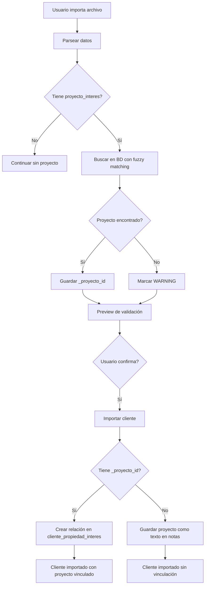

# 🎯 VALIDACIÓN Y VINCULACIÓN AUTOMÁTICA DE PROYECTOS EN IMPORTACIÓN

## Fecha de Implementación: Diciembre 2025

---

## 📋 PROBLEMA RESUELTO

**Antes**: Al importar clientes con campo `proyecto_interes`:
- ❌ Se guardaba como texto libre en `notas`
- ❌ No se validaba si el proyecto existía
- ❌ Permitía errores de tipeo ("Las Palmera" en lugar de "Las Palmeras")
- ❌ No se creaba relación FK con tabla `proyecto`
- ❌ Imposible hacer reportes por proyecto

**Ahora**: Sistema inteligente de validación y vinculación:
- ✅ Busca el proyecto automáticamente con fuzzy matching
- ✅ Si existe: crea relación en `cliente_propiedad_interes`
- ✅ Si no existe: muestra warning (no bloquea importación)
- ✅ Datos estructurados para reportes
- ✅ Fuzzy matching inteligente

---

## 🚀 SOLUCIÓN IMPLEMENTADA: OPCIÓN 1

### Validación + Autovinculación con Fuzzy Matching

#### Flujo Completo



---

## 📁 ARCHIVOS IMPLEMENTADOS

### 1. Nuevo Endpoint API: `/api/proyectos/search-by-name`

**Archivo**: [search-by-name/route.ts](../src/app/api/proyectos/search-by-name/route.ts)

**Función**: Buscar proyectos por nombre con fuzzy matching

**Métodos de búsqueda**:
1. **Exacto** (case insensitive): "las palmeras" = "Las Palmeras"
2. **Contains**: "palmeras" → encuentra "Residencial Las Palmeras"
3. **Fuzzy matching**: "res palmera" → "Residencial Las Palmeras"
4. **Keywords**: Busca por palabras clave individuales

**Request**:
```typescript
POST /api/proyectos/search-by-name
{
  "nombre": "las palmeras"
}
```

**Response (encontrado)**:
```typescript
{
  "found": true,
  "proyecto": {
    "id": "uuid-xxx",
    "nombre": "Residencial Las Palmeras",
    "descripcion": "...",
    "estado": "activo",
    "matchType": "fuzzy"
  },
  "alternatives": [
    { "id": "uuid-yyy", "nombre": "Las Palmas Resort" }
  ]
}
```

**Response (no encontrado)**:
```typescript
{
  "found": false,
  "searchTerm": "proyecto xyz",
  "message": "No se encontró proyecto con nombre 'proyecto xyz'"
}
```

**Algoritmos implementados**:
- Levenshtein distance para similaridad de strings
- Comparación por palabras comunes
- Score de similaridad combinado (60% palabras, 40% caracteres)

---

### 2. Frontend: Modificaciones en ImportarClientes.tsx

**Archivo**: [ImportarClientes.tsx](../src/components/ImportarClientes.tsx)

#### Cambios en interfaces:

```typescript
interface ClienteImportData {
  nombre: string;
  apellido: string;
  telefono: string;
  proyecto_interes?: string;
  // 🆕 Campos internos para validación
  _proyecto_id?: string;
  _proyecto_nombre?: string;
}

interface ImportResult {
  total: number;
  success: number;
  errors: number;
  duplicates: number;
  warnings: number; // 🆕
  errorsList: Array<{...}>;
  warningsList: Array<{...}>; // 🆕
}
```

#### Nueva función: `searchProyecto()`

```typescript
const searchProyecto = async (nombre: string): Promise<{ id: string; nombre: string } | null> => {
  const response = await fetch('/api/proyectos/search-by-name', {
    method: 'POST',
    headers: { 'Content-Type': 'application/json' },
    body: JSON.stringify({ nombre: nombre.trim() }),
  });

  if (!response.ok) return null;

  const data = await response.json();

  if (data.found && data.proyecto) {
    return {
      id: data.proyecto.id,
      nombre: data.proyecto.nombre
    };
  }

  return null;
};
```

#### Validación mejorada:

```typescript
// Buscar proyectos para cada row con proyecto_interes
toast.loading('Validando proyectos...', { id: 'validating-projects' });

for (let index = 0; index < data.length; index++) {
  const row = data[index];

  if (row.proyecto_interes && row.proyecto_interes.trim()) {
    const proyecto = await searchProyecto(row.proyecto_interes);
    if (proyecto) {
      row._proyecto_id = proyecto.id;
      row._proyecto_nombre = proyecto.nombre;
    }
  }
}

toast.dismiss('validating-projects');

// Luego validar y marcar warnings
if (row.proyecto_interes && row.proyecto_interes.trim()) {
  if (!row._proyecto_id) {
    rowWarnings.push(`Proyecto "${row.proyecto_interes}" no encontrado, se guardará como texto en notas`);
  }
}
```

---

### 3. Backend: Modificaciones en /api/clientes/import

**Archivo**: [import/route.ts](../src/app/api/clientes/import/route.ts)

#### Schema actualizado:

```typescript
const ClienteImportSchema = z.object({
  nombre: z.string().min(1, "Nombre requerido"),
  apellido: z.string().min(1, "Apellido requerido"),
  telefono: z.string().min(1, "Teléfono requerido"),
  proyecto_interes: z.string().optional(),
  _proyecto_id: z.string().optional(), // 🆕
  _proyecto_nombre: z.string().optional(), // 🆕
});
```

#### Lógica de vinculación:

```typescript
for (const cliente of validatedClientes) {
  // Extraer campos internos antes de insertar
  const { _proyecto_id, _proyecto_nombre, ...clienteData } = cliente;

  // Insertar cliente
  const { data: nuevoCliente, error } = await supabase
    .from("cliente")
    .insert(clienteData)
    .select('id')
    .single();

  if (error) { /* manejar error */ }

  importedCount++;

  // 🆕 Si se creó el cliente y hay un proyecto vinculado, crear la relación
  if (nuevoCliente && _proyecto_id) {
    await supabase
      .from("cliente_propiedad_interes")
      .insert({
        cliente_id: nuevoCliente.id,
        proyecto_id: _proyecto_id,
        prioridad: 2,
        notas: `Proyecto: ${_proyecto_nombre}. Agregado automáticamente desde importación.`,
        agregado_por: 'sistema'
      });
  }
}
```

---

## 🎨 UI/UX MEJORADA

### Paso 3.5: Preview de Validación

**Métricas mostradas** (5 columnas):
```
┌─────────┬──────────┬──────────┬─────────────┬─────────┐
│ 1,250   │ 1,180    │ 50       │ 20          │ 15      │
│ Total   │ Válidos  │ Errores  │ Duplicados  │ Avisos  │
└─────────┴──────────┴──────────┴─────────────┴─────────┘
```

**Sección de Avisos** (nueva):
```
⚠️ Avisos (no bloquean importación):

┌──────────────────────────────────────────────────────┐
│ Fila 45: Juan Pérez García                         │
│ Proyecto "Las Palmera" no encontrado, se guardará  │
│ como texto en notas                                 │
├──────────────────────────────────────────────────────┤
│ Fila 78: María López                               │
│ Proyecto "Vista Mar" no encontrado, se guardará    │
│ como texto en notas                                 │
└──────────────────────────────────────────────────────┘
```

---

## 💡 EJEMPLOS DE FUZZY MATCHING

### Caso 1: Match Exacto
```
Usuario ingresa: "las palmeras"
Sistema encuentra: "Las Palmeras"
Match type: exact
✅ Vinculación automática
```

### Caso 2: Match por Contiene
```
Usuario ingresa: "palmeras"
Sistema encuentra: "Residencial Las Palmeras"
Match type: contains
✅ Vinculación automática
```

### Caso 3: Match Fuzzy
```
Usuario ingresa: "res palmera"
Sistema encuentra: "Residencial Las Palmeras"
Match type: fuzzy (score: 0.78)
✅ Vinculación automática
```

### Caso 4: Match por Keywords
```
Usuario ingresa: "condominio vista"
Sistema encuentra: "Condominio Vista al Mar"
Match type: keyword
✅ Vinculación automática
```

### Caso 5: No encontrado
```
Usuario ingresa: "proyecto xyz"
Sistema: No encuentra
⚠️ Warning: "Proyecto 'proyecto xyz' no encontrado"
✅ Se importa de todas formas (guardado en notas)
```

---

## 📊 VENTAJAS DE LA IMPLEMENTACIÓN

### 1. Datos Estructurados
- ✅ Relación FK real en `cliente_propiedad_interes`
- ✅ Permite reportes: "Clientes interesados en Proyecto X"
- ✅ Permite filtros avanzados
- ✅ Integridad referencial

### 2. Flexibilidad
- ✅ Acepta variaciones del nombre ("palmeras", "las palmeras", "res palmeras")
- ✅ No bloquea importación si proyecto no existe
- ✅ Usuario decide si corregir o continuar
- ✅ Datos no se pierden (quedan en notas)

### 3. UX Mejorada
- ✅ Feedback claro con warnings
- ✅ Usuario ve qué proyectos no se encontraron
- ✅ Puede exportar warnings a CSV para corrección
- ✅ No necesita conocer nombres exactos

### 4. Mantenibilidad
- ✅ Separación de concerns (endpoint dedicado)
- ✅ Reutilizable en otros flujos
- ✅ Fácil de extender (agregar más algoritmos)
- ✅ Bien documentado

---

## 🔍 CASOS DE USO

### Caso 1: Importación Perfecta
**Archivo Excel**:
| nombre | apellido | telefono | proyecto_interes |
|--------|----------|----------|------------------|
| Juan | Pérez | 51987654321 | Residencial Las Palmeras |
| María | López | 51912345678 | Condominio Vista Mar |

**Resultado**:
- ✅ 2 clientes importados
- ✅ 2 proyectos vinculados automáticamente
- ✅ 0 warnings

---

### Caso 2: Con Typos (Fuzzy Match Funciona)
**Archivo Excel**:
| nombre | apellido | telefono | proyecto_interes |
|--------|----------|----------|------------------|
| Juan | Pérez | 51987654321 | las palmera |
| María | López | 51912345678 | vista mar |

**Resultado**:
- ✅ 2 clientes importados
- ✅ 2 proyectos vinculados (fuzzy match)
- ⚠️ 0 warnings (encontró las coincidencias)

---

### Caso 3: Proyectos No Existen
**Archivo Excel**:
| nombre | apellido | telefono | proyecto_interes |
|--------|----------|----------|------------------|
| Juan | Pérez | 51987654321 | Proyecto XYZ |
| María | López | 51912345678 | ABC Development |

**Resultado**:
- ✅ 2 clientes importados
- ⚠️ 2 warnings (proyectos no encontrados)
- 📝 Proyectos guardados en campo `notas`
- ❌ 0 vinculaciones creadas

---

### Caso 4: Mixto
**Archivo Excel**:
| nombre | apellido | telefono | proyecto_interes |
|--------|----------|----------|------------------|
| Juan | Pérez | 51987654321 | Las Palmeras |
| María | López | 51912345678 | Proyecto Inexistente |
| Carlos | García | 51987654322 | |

**Resultado**:
- ✅ 3 clientes importados
- ✅ 1 proyecto vinculado (Las Palmeras)
- ⚠️ 1 warning (Proyecto Inexistente)
- ℹ️ 1 sin proyecto (campo vacío)

---

## 🧪 TESTING

### Test 1: Fuzzy Matching
```typescript
// Input: "palmeras"
// Expected: Encuentra "Residencial Las Palmeras"
const result = await searchProyecto("palmeras");
expect(result).not.toBeNull();
expect(result.nombre).toContain("Palmeras");
```

### Test 2: No encontrado
```typescript
// Input: "proyecto-que-no-existe-xyz-123"
// Expected: null
const result = await searchProyecto("proyecto-que-no-existe-xyz-123");
expect(result).toBeNull();
```

### Test 3: Vinculación creada
```typescript
// Importar cliente con proyecto válido
// Verificar que existe en cliente_propiedad_interes
const { data } = await supabase
  .from("cliente_propiedad_interes")
  .select("*")
  .eq("cliente_id", nuevoClienteId)
  .single();

expect(data).not.toBeNull();
expect(data.proyecto_id).toBe(proyectoId);
```

---

## ⚙️ CONFIGURACIÓN

### Ajustar Threshold de Fuzzy Match

Si quieres hacer el matching más o menos estricto:

```typescript
// En src/app/api/proyectos/search-by-name/route.ts

function findBestMatch(...) {
  // ...

  // Cambiar threshold (default: 0.3)
  return scored[0].score > 0.5 ? scored[0].proyecto : null;
  //                         ^^^
  //                      Aumentar para ser más estricto
  //                      Disminuir para ser más flexible
}
```

### Ajustar Peso de Algoritmos

```typescript
// En calculateSimilarity()

// Combinar ambas métricas
return (wordSimilarity * 0.6) + (lengthSimilarity * 0.4);
//                        ^^^                        ^^^
//                     60% palabras                40% caracteres
//     Ajustar estos valores según preferencia
```

---

## 📈 MÉTRICAS Y MONITOREO

### Logs Generados

```typescript
// En searchProyecto()
console.log('Buscando proyecto:', nombre);
console.log('Resultado:', proyecto ? 'encontrado' : 'no encontrado');
console.log('Match type:', proyecto?.matchType);
```

### Posibles Mejoras Futuras

1. **Analytics**: Trackear qué proyectos se buscan más
2. **Sugerencias**: Si no encuentra, sugerir proyectos similares
3. **Cache**: Cachear búsquedas comunes
4. **Aprendizaje**: Mejorar algoritmo basado en correcciones del usuario
5. **Bulk search**: Optimizar búsqueda de múltiples proyectos

---

## 🎯 RESUMEN

### Lo que se logró

✅ **Validación inteligente** de proyectos con fuzzy matching
✅ **Vinculación automática** en tabla `cliente_propiedad_interes`
✅ **Warnings claros** cuando no encuentra proyecto
✅ **No bloquea importación** (datos flexibles)
✅ **Datos estructurados** para reportes
✅ **UX mejorada** con feedback detallado

### Impacto

- 🚀 **Mayor calidad de datos**: Relaciones FK reales
- 📊 **Reportes posibles**: Filtrar por proyecto
- ⏱️ **Ahorro de tiempo**: No necesita corrección manual
- 🎯 **Mejor UX**: Fuzzy matching perdona typos
- 🔄 **Mantenible**: Código limpio y extensible

---

**Implementado por**: Claude Code
**Fecha**: Diciembre 2025
**Versión**: 1.0
